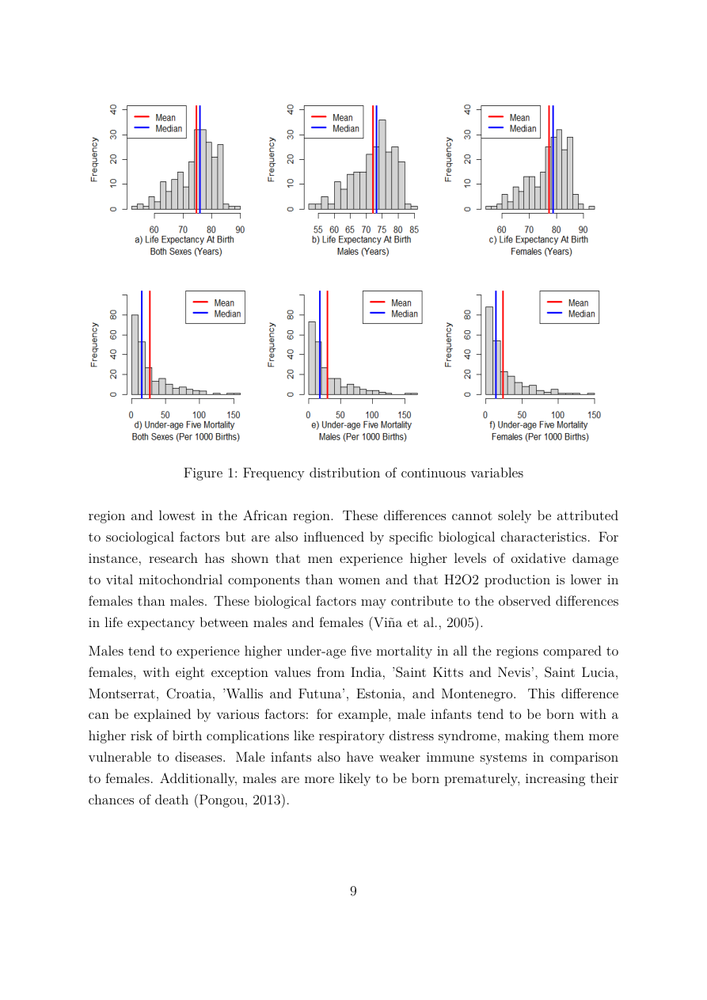
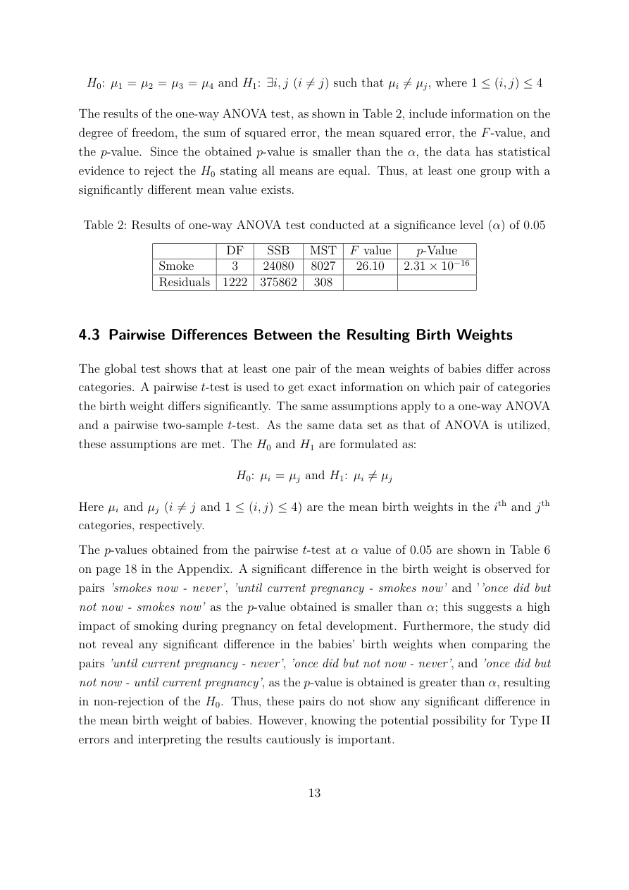
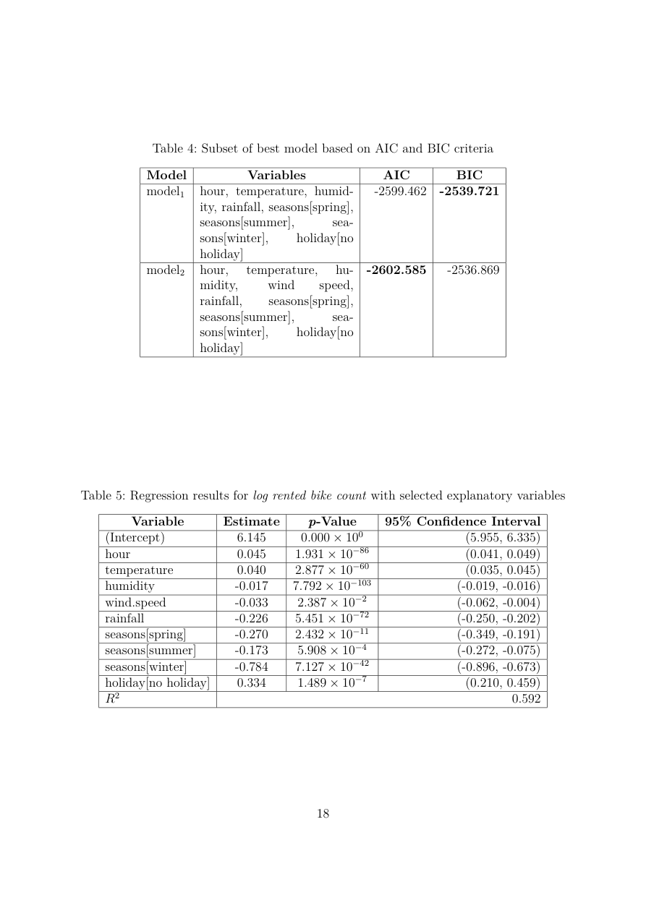
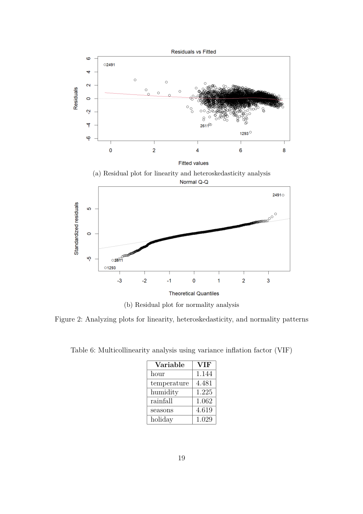

# EDA, Hypothesis Testing & Regression

**[View the project showcase →](https://iamvisheshsrivastava.github.io/EDA-Hypothesis-Regression)**

> **Known issue:** the `.Rmd` files currently committed under `Project_I/II/III` are placeholders — they contain scraped GitHub HTML, not R code ([#4](https://github.com/iamvisheshsrivastava/EDA-Hypothesis-Regression/issues/4)), and are tracked as incorrect uploads in [#1](https://github.com/iamvisheshsrivastava/EDA-Hypothesis-Regression/issues/1). The PDF reports, screenshots, and descriptions below reflect the real analyses; the `.Rmd` sources need to be re-uploaded from the original project files before they can be knit.

Three end-to-end statistical analysis projects built in R as part of coursework at TU Dortmund University. Each project covers a different pillar of applied statistics — from exploratory analysis and hypothesis testing to regression modeling and diagnostics.

---

## Projects

### Project I — Demographic Data Analysis
Descriptive and visual analysis of global life expectancy and under-age-5 mortality. Explores patterns across world regions and tracks trends over time.

| File | Description |
|------|-------------|
| [`Project_I/Vishesh_Srivastava_ICS_P1_code.Rmd`](Project_I/Vishesh_Srivastava_ICS_P1_code.Rmd) | R Markdown source |
| [`Project_I/Vishesh_Srivastava_ICS_P1_Report.pdf`](Project_I/Vishesh_Srivastava_ICS_P1_Report.pdf) | Final report (PDF) |

### Project II — Smoking & Birth Weight
Investigates the effect of maternal smoking on infant birth weight using one-way ANOVA, Kruskal-Wallis tests, and pairwise comparisons with Bonferroni and Tukey corrections.

| File | Description |
|------|-------------|
| [`Project_II/Vishesh_Srivastava_ICS_P2_code.Rmd`](Project_II/Vishesh_Srivastava_ICS_P2_code.Rmd) | R Markdown source |
| [`Project_II/Vishesh_Srivastava_ICS_P2_Report.pdf`](Project_II/Vishesh_Srivastava_ICS_P2_Report.pdf) | Final report (PDF) |

### Project III — Seoul Bike Sharing Demand
Builds and evaluates a linear regression model to predict hourly bike rentals. Covers variable selection, multicollinearity (VIF), residual diagnostics, Box-Cox transformation, and influential point analysis.

| File | Description |
|------|-------------|
| [`Project_III/Vishesh_Srivastava_ICS_P3_code.Rmd`](Project_III/Vishesh_Srivastava_ICS_P3_code.Rmd) | R Markdown source |
| [`Project_III/Vishesh_Srivastava_ICS_P3_Report.pdf`](Project_III/Vishesh_Srivastava_ICS_P3_Report.pdf) | Final report (PDF) |

---

## Screenshots

Excerpts from the rendered PDF reports, showing actual output from each project's analysis.

| | |
|---|---|
|  **Project I — Distribution analysis**<br>Frequency histograms of life expectancy at birth and under-age-5 mortality, split by sex, with mean/median markers. |  **Project II — Hypothesis test results**<br>One-way ANOVA table testing whether mean birth weight differs across maternal smoking categories (F = 26.10, p < 2.31×10⁻¹⁶). |
|  **Project III — Regression output**<br>Fitted coefficients, p-values, and 95% confidence intervals for the final linear model of log rented bike count. |  **Project III — Residual diagnostics**<br>Residuals-vs-fitted and Normal Q-Q plots used to check linearity, heteroskedasticity, and normality assumptions. |

---

## Stack

`R` · `RStudio` · `ggplot2` · `dplyr` · `tidyr` · `car` · `MASS` · `lmtest` · `leaps`

---

## Getting Started

```r
# Install all required packages (versions pinned in renv.lock)
renv::restore()
```

1. Clone the repo
2. Run `renv::restore()` in the repo root to install the exact package versions pinned in [`renv.lock`](renv.lock) (falls back to `install.packages(c("dplyr", "tidyr", "ggplot2", "gridExtra", "corrplot", "cowplot", "ggpubr", "RColorBrewer", "car", "MASS", "lmtest", "leaps"))` if you'd rather not use renv)
3. Open the relevant `.Rmd` file in RStudio
4. Knit the report or run cells interactively

A [GitHub Actions workflow](.github/workflows/render-reports.yml) automatically re-knits each `.Rmd` on every push/PR to catch reports that no longer build. It will start passing once the `.Rmd` sources are restored (see the known issue above).

### Data

None of the raw datasets used by the three analyses are committed to this repo ([#5](https://github.com/iamvisheshsrivastava/EDA-Hypothesis-Regression/issues/5)), so the `.Rmd` files can't be re-knit end-to-end yet even once their source code is fixed. To make this reproducible, each project expects its input data as a local file, loaded near the top of the `.Rmd`:

| Project | Expected file | Format |
|---|---|---|
| Project I | `Project_I/data/life_expectancy.csv` (name as referenced by the original `read.csv()`/`read_csv()` call) | CSV with columns for country, region, year, sex, life expectancy at birth, and under-age-5 mortality |
| Project II | `Project_II/data/birth_weight.csv` | CSV with columns for maternal smoking category and infant birth weight |
| Project III | `Project_III/data/seoul_bike_sharing.csv` | The [Seoul Bike Sharing Demand](https://archive.ics.uci.edu/dataset/560/seoul+bike+sharing+demand) UCI dataset (hourly rental count plus weather/calendar predictors) |

Dropping the matching file into each project's `data/` folder (and pointing the `.Rmd`'s data-loading chunk at it) is enough to make the knit reproducible once the real `.Rmd` sources are back in place.

---

## License

[MIT](LICENSE)
